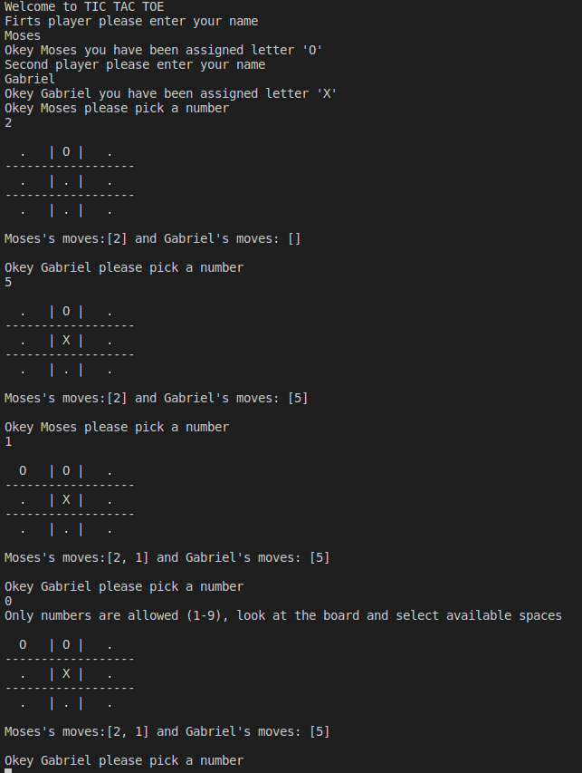

## TIC TAC TOE
* This is a practical project to create a tic tac toe game using ruby and the object oriented concept.

## TIC TAC TOE GAME DESCRIPTION
 * Tic-tac-toe is a game for two players, X and O, who take turns marking the spaces in a 3×3 grid. The player who succeeds in placing three of their marks in a horizontal, vertical, or diagonal row is the winner.

## STARTING THE GAME.
* On you computer get to directory you want to keep the files
    run => git clone https://github.com/gabrie-lhilarion/tic-tac-toe.git 
    run => cd tic-tac-toe 
    run => bin/main.rb 
* Playing the game  
   * To play the game two players need to provide their names, then the computer would assign each person a leter either X or O.
    Each player will choose from the spaces in the board which are actually numbers and which will be replaced by the letter assign to the player. The player who is able to place three continues letter either vertically, horizontally or diagonally wins the game, or the game is a draw.

# Built With
* Ruby
* Rubocop
* Visual Studio Code

# Live Demo
**[Live Demo](https://repl.it/@gabrielhilarion/LawngreenNeatRecords#main.rb)**

# Authors

👨 **Gabriel Hilarion**

* Github: **[@gabrie-lhilarion](https://github.com/gabrie-lhilarion)**
* Twitter: **[@gabrie-lhilarion](https://twitter.com/gabrielDeman)**

👨 **Oloo Moses**
- Twitter: https://twitter.com/olooine
- Github: https://github.com/oloomoses

#  Contributing

Contributions, issues and feature requests are welcome!
Feel free to check the **[issues](https://github.com/gabrie-lhilarion/tic-tac-toe/issues)** page.

#  Show your support

  Give ⭐️ if you like this project!

# Acknowledgments

* The odin project
* Microverse
* Team 116 of Microverse
